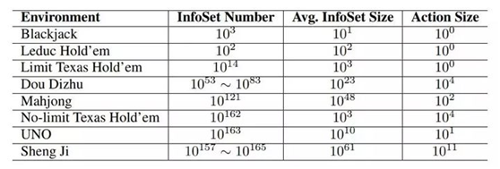
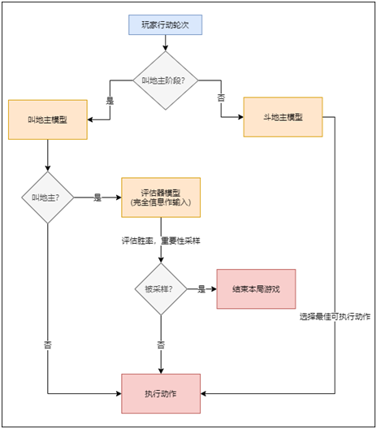
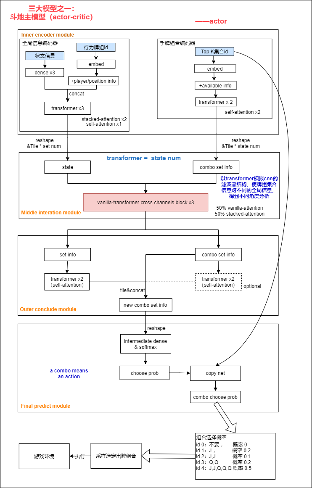
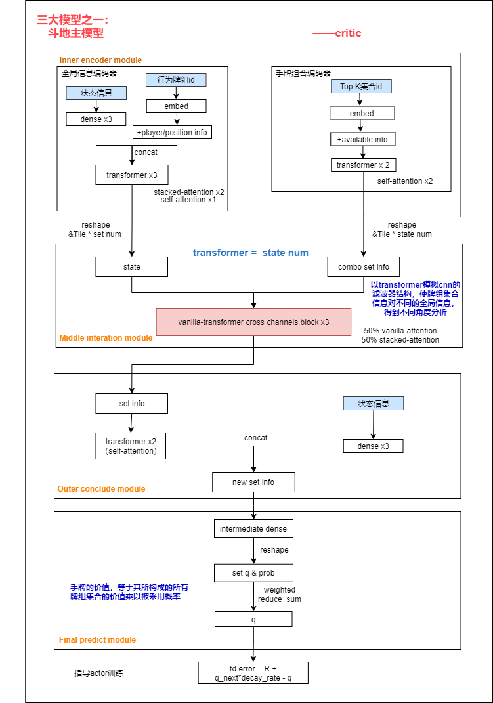
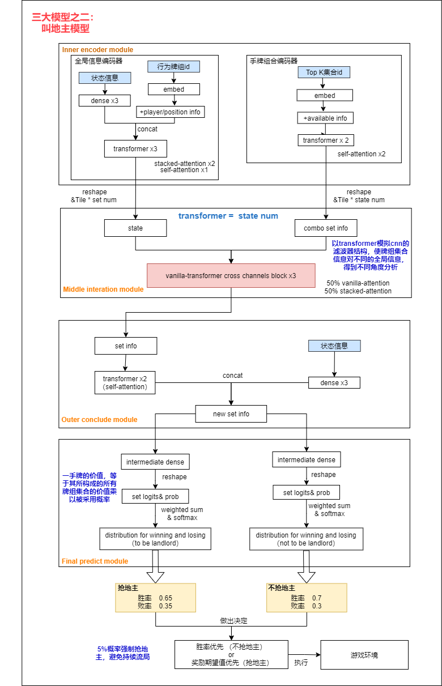
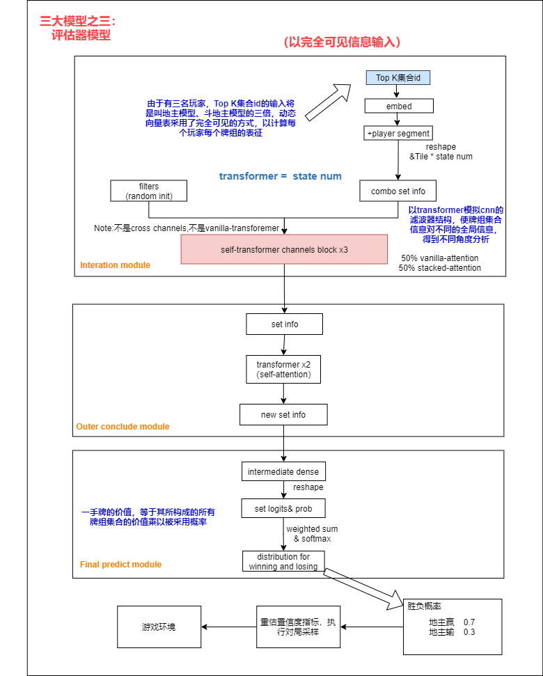

# ddz-ai

## 介绍

斗地主是一种扑克游戏。游戏最少由3个玩家进行，用一副54张牌（连鬼牌），其中一方为地主，其余两家为另一方，双方对战，先出完牌的一方获胜。

ddz-ai以孤立语假设和宽度优先搜索为基础，构建了一种多通道堆叠注意力Transformer结构的系统，使其经过大量训练后，能在实际游戏中获得媲美/超越人类表现的能力。


## ddz-ai做了什么
***1.新颖但更洞若观火的解决思路***。以孤立语思想和宽度优先搜索为基础来解读牌信息，模型得以感知到一手牌所有出色的组合方式，并根据实时对局状态执行对策选择

***2.设计更适配的模型***。创新了多通道交叉通信的transformer cross channels以编码多视角特征，设计了堆叠注意力机制以完善多牌信息融合、丰富牌组信息多样性

***3.复杂度问题得到解决***。在不同对局、时段，以牌组为元构造了更精准表征向量的动态表，进而使用copy net结构大幅减少行为空间复杂度、简化了模型的推理难度

***4.减弱非完全信息的影响***。针对非完全信息博弈任务，设计了利用完全信息进行Importance Sampling的评估器模型，从而大幅提高学习速率和效果

***5.对局的时序信息被考虑***。建模了对局历史行为记录，能够从各位玩家的行为中了解他们的出牌规律，更精准预测其它玩家余牌及整体局势

***6.合理的策略***。在叫地主环节同时推算了叫地主、不叫地主的胜率，使用两者的胜率差或者奖励期望值差能够更合理地指导决策

***……***

## 运行环境

```
Package              Version
-------------------- ---------
numpy                1.19.5
tensorflow           1.13.1
```

## 使用说明

### 模型训练

本系统搭建了斗地主的游戏环境，因此运行过程无需依赖外部。可参考运行环境依赖，确保模型的正常运行后，直接使用下列命令训练模型，使模型自对抗学习。
```
python train.py
```
关于训练的参数，如：batch_size、state_num、learning rate等，可修改RL类的实例化过程进行编辑。

### 模型测试

仅训练并公布了actor-critic机制的模型（受限于时间、资源问题），后期优化的PPO版本或许训练更快、效果更好，感兴趣的朋友可以自行测试。目前，公布模型比一般人类表现要略好。它在一个拥有16GB RAM的CPU上进行了自对抗训练，训练用时为1周，执行游戏局数万轮（包括，无人叫地主导致流局的情况）。

在强化学习模型大多使用千万级、亿级对局训练的大环境下，该模型的学习程度还远远不足。目前，由于缺乏数据和计算资源，未能探究系统的极限。我正在努力持续优化这一系统，以提高它的整体表现。有关更多细节，请参阅TODO LIST一节。

关于模型效果的测试，您可以独立训练模型或解压公布模型到data目录，并通过修改test.py的参数init_checkpoint或start_iter加载训练好的模型，调用以下命令查看模型的效果。
```
python test.py
```
预期您会看到如下格式的内容：
```
玩家 2 抢地主 1 手上的牌 3,3,4,4,4,5,5,5,6,6,7,8,10,J,J,Q,A,2,2,2
---评估器认为地主将获得胜利---
玩家 2 出牌 4,4,4,5,5,5,7,Q 余牌 3,3,6,6,8,10,J,J,A,2,2,2
玩家 0 出牌 不要 余牌 3,5,6,6,7,7,8,9,10,10,Q,K,K,A,A,小王,大王
玩家 2 出牌 3,3 余牌 6,6,8,10,J,J,A,2,2,2
玩家 0 出牌 6,6 余牌 3,5,7,7,8,9,10,10,Q,K,K,A,A,小王,大王
玩家 1 出牌 8,8 余牌 3,4,7,9,9,9,10,J,J,Q,Q,K,K,A,2
玩家 2 出牌 J,J 余牌 6,6,8,10,A,2,2,2
玩家 0 出牌 不要 余牌 3,5,7,7,8,9,10,10,Q,K,K,A,A,小王,大王
玩家 1 出牌 不要 余牌 3,4,7,9,9,9,10,J,J,Q,Q,K,K,A,2
玩家 2 出牌 6,6 余牌 8,10,A,2,2,2
玩家 0 出牌 7,7 余牌 3,5,8,9,10,10,Q,K,K,A,A,小王,大王
玩家 1 出牌 不要 余牌 3,4,7,9,9,9,10,J,J,Q,Q,K,K,A,2
玩家 2 出牌 2,2 余牌 8,10,A,2
玩家 0 出牌 不要 余牌 3,5,8,9,10,10,Q,K,K,A,A,小王,大王
玩家 2 出牌 8 余牌 10,A,2
玩家 0 出牌 A 余牌 3,5,8,9,10,10,Q,K,K,A,小王,大王
玩家 1 出牌 2 余牌 3,4,7,9,9,9,10,J,J,Q,Q,K,K,A
玩家 0 出牌 小王,大王 余牌 3,5,8,9,10,10,Q,K,K,A
玩家 0 出牌 3 余牌 5,8,9,10,10,Q,K,K,A
玩家 1 出牌 Q 余牌 3,4,7,9,9,9,10,J,J,Q,K,K,A
玩家 2 出牌 2 余牌 10,A
玩家 2 出牌 10 余牌 A
玩家 0 出牌 A 余牌 5,8,9,10,10,Q,K,K
玩家 0 出牌 5 余牌 8,9,10,10,Q,K,K
玩家 1 出牌 A 余牌 3,4,7,9,9,9,10,J,J,Q,K,K
玩家 1 出牌 7,9,9,9 余牌 3,4,10,J,J,Q,K,K
玩家 1 出牌 3 余牌 4,10,J,J,Q,K,K
玩家 2 出牌 A 余牌 
玩家 0 获得奖励 -1
玩家 1 获得奖励 -1
玩家 2 获得奖励 2
```

### 使用外部环境测试

当脱离本系统的游戏环境时，可以通过调用以下命令实时对抗，它将根据您的手牌和对局状况提供行为建议。具体如何操作，请按照指示执行。
```
python online.py
```

## 实验状况

条件        | 状况
-----------| :-------------: 
数据        | 无数据，纯RL模型自对抗学习
时长        | 1周，执行游戏数万轮

## 系统介绍

### 斗地主的潜在问题

1.行动空间庞大，举个例子飞机带几个单张，有超多种可能。需要进行动作空间的搜索和简化、采样。



2.动作的价值估计。首先，在不同对局、不同时段中，同样的牌组（合理的牌组合，如单张、对子、三带一等）表现的信息是不同的。其次，每一次行动并不只是比较可选动作集而已，还要考虑每次出牌后的牌组集合价值，与对家的关系、与队友的关系（农民）等整体状态、策略。

3.不完全信息博弈。手上的牌有时非常好，但是不可见的是，已被对手完全的克制，实际上这一局完全没有胜利的希望，这样模型学习起来往往是无益的。

4.不同阶段不同身份，存在不同的分析决策方式。我的牌很好，但是叫地主？也许会破坏牌。牌很差，但是差几张就会顺？搏一搏，也许胜率更高！此外地主独自战斗，农民之间又讲究协作。

5.人格揣测。根据每一位选手的出牌规律、习惯，猜测ta手上的余牌—>虚张声势？or确有其事？or声东击西...从对家的出牌中学习知识，也要结合自身的牌，理性思考。

6.试验环境与数据。不同的玩家思维/策略不同，模型的分析能力未必适用。

### 解决思路


*   你手上的牌在说话

对我而言，斗地主有点像孤立语。在中文，一句话也许会表达出很多种意思，比如：水有限，把它留给晚上来的人。不同的断句，“晚（一些） 上来”、“晚上（时间段） 来”将表达出不同的含义。

斗地主中，一手牌按照不同的组合方式，其表达的含义是不一致的。在这种情况下，一手牌必须按符合规则的方式，变化为可执行的牌组（合理的牌组合，如单张、对子、三带一等）的集合才具备意义，也才拥有可以评估和分析的基础。

*   宽度优先搜索

由于一手牌的排列组合方式，实在是太多太多，如果一一列举将导致过度庞大的空间。但万幸的是，越小的牌组集合，往往胜率越大。或许正因为此，斗地主又称跑得快。


``
“假如手中有20张牌，只靠单张去出，集合里有20个牌组；但是采用飞机、顺子、炸弹等方式，可能集合里就只有1到3个牌组。而且越复杂的牌组，对手要得起的可能性越小。”
``

在这种情况下，采用宽度优先搜素的方式去寻找小的牌组集合，以达到缩小复杂度的作用。经分析，寻找到最小的Top 100牌组集合，基本就能囊括一手牌的【有价值牌组集合】。至于往后的牌组集合，常常是不会被应用的无意义集合。

*   多模型调度

斗地主游戏中存在两个阶段：叫地主阶段、出牌阶段。其中出牌阶段需要区分有牌权和无牌权状况（无牌权情况要接得住上轮出牌）。因此有必要针对不同阶段、状况来做相应的模型。

*   重要性采样（利用完全信息加速模型训练）

手上的牌有时非常好，但是不可见的是，已被对手完全的克制，实际上这一局完全没有胜利的希望，往往是无益于模型的学习，对局便是浪费资源。在对局开始前，采用完全信息模型（可以看到所有玩家的牌），判断每位玩家的胜率，执行重要性采样。如果地主和农民旗鼓相当，倾向于执行和采样该对局；反之，当他们判若天渊，则倾向于跳过无意义对局。

### 模型架构

#### 三大模型

斗地主ai一般由两个模型组成：**叫地主模型**和**斗地主模型**。其中，叫地主模型用以在开局时判断是否要抢地主，决定参赛选手身份，而斗地主模型则是为团队（农民或地主）尽快出完牌作决策。在本系统提出了减小不完全信息影响、提高训练效率的**评估器模型**，以对游戏进行重要性采样。


#### 假设一：一手牌的强度等于其构成的所有牌组集合的强度乘以被采用概率

* 是否叫地主？这局游戏是否胜负明显？出牌后，是否能带来更好的state？无论是叫地主模型、评估器模型还是斗地主模型的critic部分，其本质都是在对比玩家间牌的相对强度，因此提出“假设一”用以解决牌强度的计算问题。


#### 假设二：某个可执行牌组的执行概率等于所有牌组集合内的该牌组执行概率乘以相应牌组集合被采用概率（或者，所有牌组集合内该可执行牌组的执行概率的和）

* 出牌阶段寻找到多个可执行牌组，每个可执行牌组存在于一个或多个牌组集合之中，如何计算可执行牌组的价值？直接且合理的想法就是，利用多个牌组集合的采用概率加权该可执行牌组在各个牌组集合的执行概率并求和。

以上两个假设奠定了本系统建模理论，深度优先搜索解决了牌组集合的空间复杂度问题，动态向量表使得同一个牌组在不同对局、时段的牌组也拥有表征，简化模型的推理难度，这些构成使用深度强化学习模型完成斗地主ai的前提条件。

在此基础上，ddz-ai创新stacked-attention来完善多牌信息的融合和transformer cross channels实现外部状态与牌组集合的多通道交叉通信，设计不完全信息任务的重要性采样提高学习速率和效果，使用copy-net、actor-critic、gradient clip等方式实现三种模型。
   
#### 一：斗地主模型（actor-critic）




#### 二：叫地主模型



#### 三：评估器模型



## TODO LIST

1.*猜牌*：当其它玩家的牌量较少时，利用神经网络进行余牌预测，对预测结果使用博弈树搜索的方式寻找最优解法。

2.*行为探索*：就几万对局的训练而言，模型对农民方互相协作的策略探索度不足，导致模型倾向于互殴，地主胜率要高于农民。可以考虑：寻找真实环境的数据使模型快速收敛，后联合采用自对抗体系进一步优化模型；增加协助奖励机制，以及加大对协助行为的采样。

3.*更大的系统*：目前，无论牌组集合的采样，还是所搭建模型的宽度、深度，都属于比较简易的。考虑通过扩大采样范围、优化采样方法和使用更大模型，来获得更佳表现。

4.*数据不均衡*：评估器模型、叫地主模型都存在数据不均衡问题，值得等待解决。